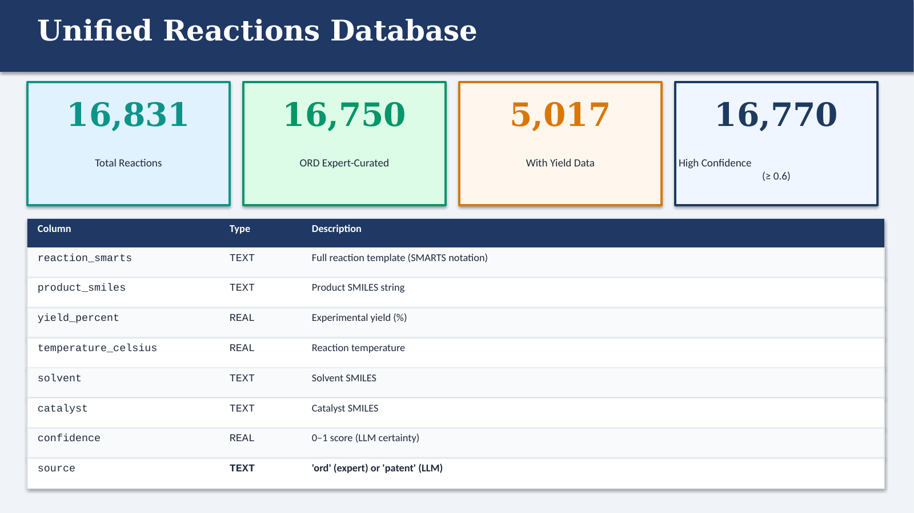
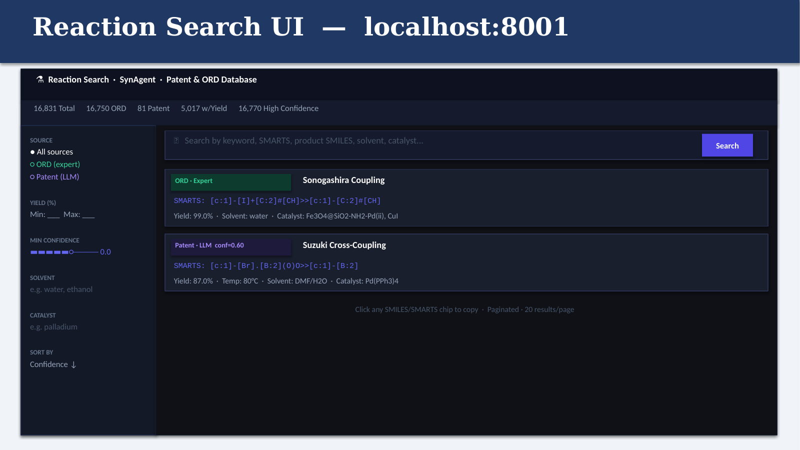
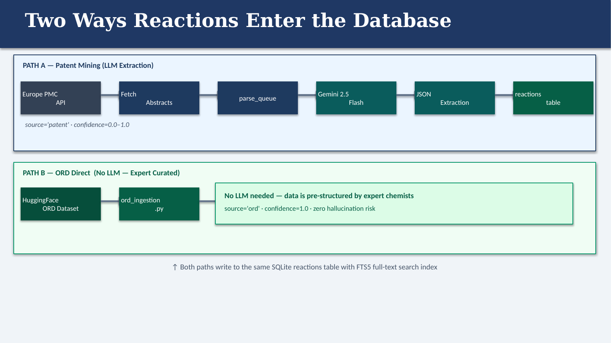
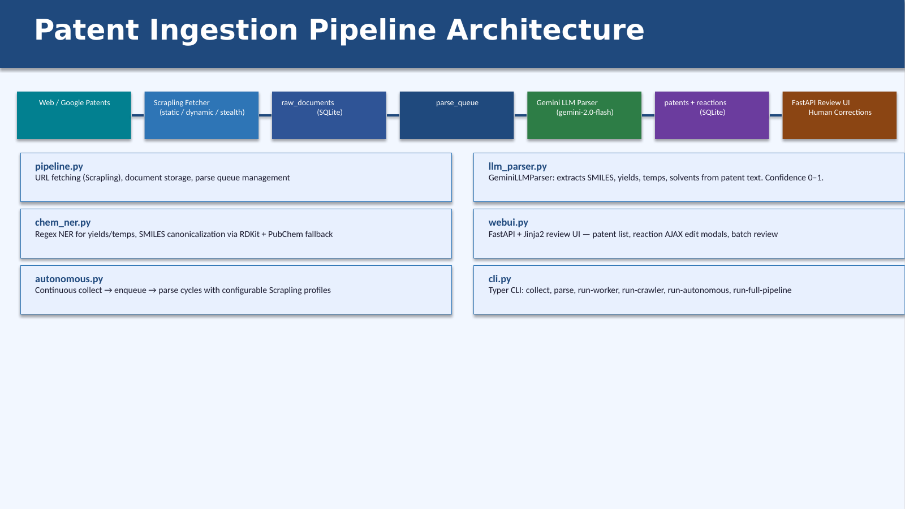
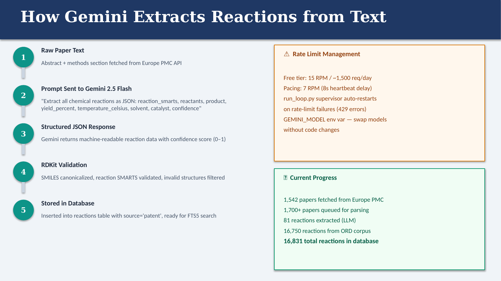
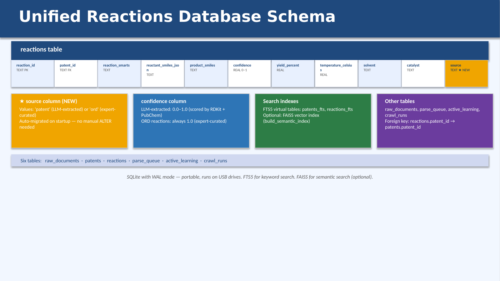
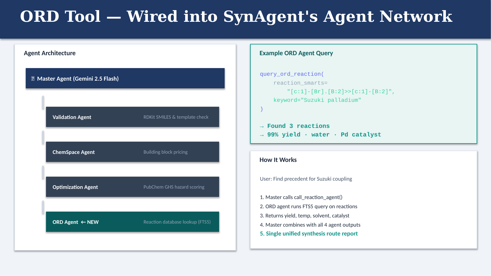

# SynAgent: Chemical Reaction Database & Patent Scraping Pipeline

> **Part of the SynAgent project** — a multi-agent AI framework for automated drug discovery built on top of [SynLlama](https://pubs.acs.org/doi/10.1021/acscentsci.5c01285) (ACS Central Science, 2025), developed at the **Head-Gordon Group, UC Berkeley / Lawrence Berkeley National Lab**.

This repository contains the **data infrastructure layer** of SynAgent: an end-to-end ETL pipeline that scrapes chemical patents, extracts structured reaction data using LLMs, ingests curated datasets from the Open Reaction Database (ORD), and stores everything in a queryable SQLite schema — forming the training and retrieval backbone for downstream AI synthesis planning agents.

---

## Why This Exists

Large language models for synthesis planning (like SynLlama) require high-quality, structured reaction data to fine-tune on and retrieve from. Public chemical databases are massive but unstructured — patents describe reactions in prose, IUPAC names instead of SMILES, and inconsistent formats. This pipeline solves that:

1. **Scrapes** Europe PMC / Google Patents for chemistry-relevant documents
2. **Parses** unstructured patent text into structured reaction records using an LLM (Gemini 2.5 Flash, or a local OpenAI-compatible Qwen endpoint on Savio)
3. **Validates** extracted SMILES strings via RDKit canonicalization and PubChem cross-referencing, with a confidence score
4. **Ingests** expert-curated reactions from the Open Reaction Database (ORD) via HuggingFace
5. **Stores** everything in a structured SQLite database with FTS5 full-text search and an optional FAISS semantic index
6. **Serves** the corpus through a standalone FastAPI search frontend at `localhost:8001`

The resulting database is consumed by the `ord` agent inside SynAgent's master orchestrator so retrosynthesis routes can be scored against real experimental precedent — not just LLM intuition.

---

## What the Database Looks Like

The unified `reactions` table holds **16,831 reactions** today: 16,750 expert-curated from ORD plus 81 LLM-extracted from patent literature, of which 5,017 carry real experimental yield data.



The search frontend (`reaction_search_app.py`) renders the corpus as filterable cards over the SQLite FTS5 index, with separate badges for ORD-expert vs Patent-LLM rows and one-click copy on every SMILES / SMARTS chip:



---

## Architecture

There are two parallel ingestion paths that both write into the same `reactions` table:



* **Path A — Patent Mining (LLM-extracted).** Europe PMC → `parse_queue` → Gemini 2.5 Flash → JSON validation → row with `source='patent'` and `confidence ∈ [0, 1]`.
* **Path B — ORD Direct (Expert-curated).** HuggingFace ORD stream → `ord_ingestion.py` → row with `source='ord'`, `confidence=1.0`. No LLM is in the loop, so there is zero hallucination risk on these.

The full pipeline that backs Path A:



How a single document moves from raw text to a validated row:



---

## Database Schema

The core ML training table is `reactions`:



| Column | Type | Description |
|---|---|---|
| `reaction_id` | TEXT PK | Unique reaction identifier |
| `patent_id` | TEXT FK | Parent patent or `ORD-DATASET` |
| `reaction_smarts` | TEXT | Reaction SMARTS string (`reactants>>products`) |
| `reactant_smiles_json` | TEXT | JSON array of reactant SMILES |
| `product_smiles` | TEXT | Canonical product SMILES (RDKit-validated) |
| `confidence` | REAL | 0.6 (RDKit valid) + 0.4 (PubChem match) — 1.0 for ORD |
| `yield_percent` | REAL | Experimental yield % |
| `temperature_celsius` | REAL | Reaction temperature |
| `solvent` | TEXT | Solvent(s) used |
| `catalyst` | TEXT | Catalyst / reagents |
| `time_hours` | REAL | Reaction duration |
| `mechanism_text` | TEXT | Mechanism description (e.g. SN2, esterification) |
| `source` | TEXT | `'patent'` (LLM-extracted) or `'ord'` (expert-curated) |
| `metadata_json` | TEXT | Confidence breakdown, review flags, parser provenance |

Supporting tables: `patents` (scraped metadata), `raw_documents` (raw HTML/text for re-parsing), `parse_queue` (async worker state), `active_learning` (human correction log), plus FTS5 virtual tables `patents_fts` and `reactions_fts`.

---

## How the ORD Tool Plugs into SynAgent

The database is exposed to SynAgent's master agent as a **new ORD tool** that runs alongside the existing validation / ChemSpace / optimization agents:



```python
query_ord_reaction(
    reaction_smarts="[c:1]-[Br].[B:2]>>[c:1]-[B:2]",
    keyword="Suzuki palladium",
)
# → 3 reactions, 99% yield, water solvent, Pd catalyst
```

The master agent calls `call_reaction_agent()` in parallel with the other specialists and folds the precedent (yield, temp, solvent, catalyst) into the unified route report.

---

## Key Components

| Module | What it does |
|---|---|
| `database.py` | WAL-mode SQLite with FTS5 over `patents` and `reactions`; SMILES substring search; low-confidence query helper |
| `models.py` | `RawDocument`, `PatentRecord`, `ReactionRecord` dataclasses — the schema contract |
| `patent_search.py` / `patent_spider.py` | Scrapling-based async crawler for Google Patents and Europe PMC, with `static` / `dynamic` / `stealth` profiles |
| `llm_parser.py` | `GeminiLLMParser` — structured-JSON extraction prompt + parsing, supports any OpenAI-compatible endpoint |
| `chem_ner.py` | Regex NER (yields, temperatures), SMILES canonicalization, RDKit + PubChem confidence scoring |
| `pubchem.py` | Async PubChem REST client — name → SMILES, SMILES → canonical |
| `ord_ingestion.py` / `ord_pb_ingestion.py` | Streams `open-reaction-database/ord-data` from HuggingFace; schema-tolerant ingest |
| `csv_ingestion.py` / `bulk_downloader.py` | PatentsView weekly USPTO chemistry CSVs (free, no key); drag-and-drop CSV ingestion |
| `pipeline.py` / `autonomous.py` | Orchestrates `collect → enqueue → parse → validate` loops with restart on rate-limit failures |
| `reaction_search_app.py` | Standalone FastAPI search UI on port 8001 (the screenshot above) |
| `webui.py` | FastAPI + Jinja2 human-in-the-loop review UI with AJAX modal edits and a `/batch_review` page for `confidence < 0.6` |

---

## Quickstart

```bash
git clone https://github.com/A-Sanil/SynAgent-Database-and-Scraping-Pipeline.git
cd SynAgent-Database-and-Scraping-Pipeline/patent_ingestion_pipeline

python -m venv .venv
source .venv/bin/activate         # .venv\Scripts\activate on Windows
pip install -e .

cp .env.example .env              # add GEMINI_API_KEY
```

### Ingest ORD (no API key)
```python
from patent_pipeline.database import PatentDatabase
from patent_pipeline.ord_ingestion import ingest_ord_dataset

db = PatentDatabase()
print(ingest_ord_dataset(db, limit=5000), "rows inserted")
```

### Scrape and parse patents
```bash
python run_worker.py --query "palladium catalyzed cross coupling" --limit 20
# or for continuous, supervisor-managed mode:
python run_loop.py
```

### Serve the search UI
```bash
python reaction_search_app.py
# → http://localhost:8001
```

### Query from Python
```python
from patent_pipeline.database import PatentDatabase
db = PatentDatabase()

db.search_text("Suzuki coupling boronic acid")
db.search_by_smiles("c1ccccc1")
db.list_low_confidence_reactions(threshold=0.6)
```

---

## Configuration

```env
GEMINI_API_KEY=your_key_here
GEMINI_MODEL=gemini-2.5-flash

# Or use any OpenAI-compatible local endpoint (vLLM/Qwen on Savio, Ollama, ...)
PATENT_LLM_BASE_URL=http://127.0.0.1:8000
PATENT_LLM_MODEL=qwen2.5-72b
PATENT_LLM_API_KEY=optional

# DB lives here; set once and every script picks it up
PATENT_DATA_DIR=D:/SynAgent          # or /mnt/usb/synagent
```

---

## Connection to SynLlama

This pipeline was built as the data infrastructure for **SynAgent**, which wraps [SynLlama](https://pubs.acs.org/doi/10.1021/acscentsci.5c01285) — a Llama3-based model fine-tuned for retrosynthesis planning, published in *ACS Central Science* (2025) by the Head-Gordon Group at UC Berkeley.

The structured records produced by this pipeline (SMILES pathways, reaction SMARTS, yield/condition metadata) feed the fine-tuning corpus and the retrieval index that SynAgent's `ord` agent queries during route evaluation.

```bibtex
@article{sun2025synllama,
  title   = {SynLlama: Generating Synthesizable Molecules and Their Analogs with Large Language Models},
  author  = {Sun, Kunyang and Bagni, Dorian and Cavanagh, Joseph M. and Wang, Yingze
             and Sawyer, Jacob M. and Zhou, Bo and Gritsevskiy, Andrew and Zhang, Oufan
             and Head-Gordon, Teresa},
  journal = {ACS Central Science},
  year    = {2025},
  doi     = {10.1021/acscentsci.5c01285}
}
```

---

## Next Steps

The database is in place; the next milestone is to make it **queryable by an agent** rather than only by humans. The plan:

### 1. Build a "similar reactions" agent tool

Wrap the database in a tool an agent can call. The mental model that's driving the design:

> **All an agent is is a system prompt and a set of tools.**

So we add a tool with this contract:

```python
# pseudo-tool exposed to the master agent
def find_similar_reactions(reaction_smarts: str, top_k: int = 5) -> list[ReactionHit]:
    """Given a query reaction SMARTS, return the top-k most similar reactions
    from the database along with their yields, conditions, and a similarity score."""
```

Similarity uses **RDKit's Python API** (rdkit.org) to compute **Tanimoto similarity** over Morgan / reaction fingerprints — the same metric the cheminformatics community already uses for substructure neighborhoods. Anything above a tunable threshold (e.g. `tanimoto ≥ 0.7`) counts as a hit.

This is the "database for similar reactions" sketch from the whiteboard:

> *Take a reaction, change it a little bit, then → see if it matches, or if it works.*

i.e. perturb the query SMARTS (swap a leaving group, change a substituent), look it up, and the tool tells the agent whether the literature already validates that perturbation.

### 2. Validate the lookup tool against our own corpus

Use the 16,831 reactions we already have as ground truth:

- **Hold-out test.** Pull ~3,000 reactions out of the database. Run the lookup tool on each held-out reaction's products and ask: does it find the original reaction back? Report recall@k.
- **Train / validation split.** Build a `train` set and a `validation` set from the corpus, making sure to also include **very dissimilar reactions** in the validation set so the tool is forced to return *nothing* (or low-confidence) when there is no real precedent — that's how we catch false positives.
- **Yield calibration with CI.** When the tool reports a predicted yield based on its top-k hits, report the **mean ± confidence interval** (e.g. bootstrap 95% CI over the retrieved yields) so the agent gets a calibrated answer rather than a single number.

### 3. Wire the tool into the agent via MCP / Pydantic AI

[MCP (Model Context Protocol)](https://modelcontextprotocol.io/) is the protocol that lets agents expose and consume tools in a standard way — that's how this lookup tool will be made available to SynAgent's master orchestrator (and to other MCP-compatible clients).

For the in-process Python side, use **Pydantic AI's tools/toolsets** abstraction:

- Pydantic data validation: https://pydantic.dev/docs/validation/latest/get-started/
- Pydantic AI tools & toolsets: https://pydantic.dev/docs/ai/tools-toolsets/tools/

Each tool gets a Pydantic-typed signature (input + output schema), so the LLM cannot pass malformed SMARTS, and downstream code gets validated `ReactionHit` objects back. Combined with the "system prompt + tools" framing above, the entire "similar reactions" capability is just one Pydantic-typed function plus its docstring.

### 4. Existing roadmap (carried over)

- FAISS semantic index over reaction embeddings as a second retrieval channel alongside FTS5
- Active-learning fine-tuning loop using the `active_learning` corrections table as RLHF-style signal
- PatentsView bulk integration on a weekly cron — free USPTO grants, no API key
- Deploy the search UI to the web so the rest of the group can use it without a local checkout
- Drain the ~1,700 papers already queued for parsing

---

## What to Push

Push the `patent_ingestion_pipeline/` directory plus this README. The repo intentionally excludes:

- `src/synagent/` — the private SynAgent agent logic (lives in the parent repo)
- `data/*.db` — local SQLite databases (regenerated by ingestion)
- `.env` — API keys
- `usb_app/` — internal USB-mode tooling
- `SynAgent_*.pptx`, `*.docx`, `PRESENTATION.*` — internal slides and reports
- `test_usb_mount/` — local test fixtures

The `.gitignore` in this repo encodes all of the above.

---

## License

MIT — see `LICENSE` file.

*Built at Lawrence Berkeley National Lab / UC Berkeley Head-Gordon Group, 2025–2026.*
